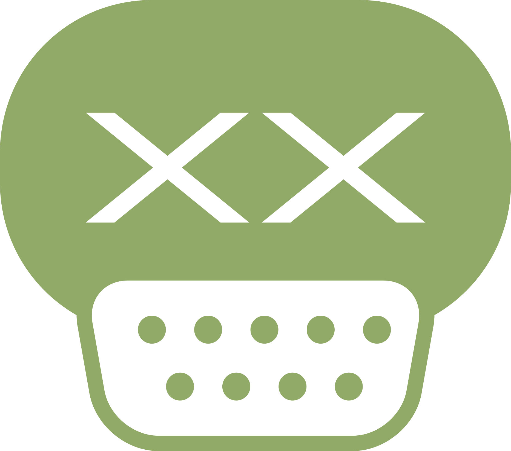
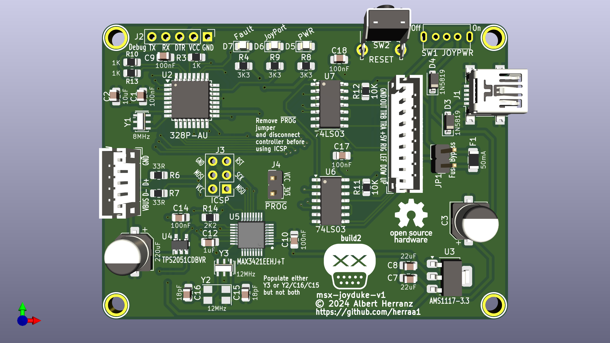
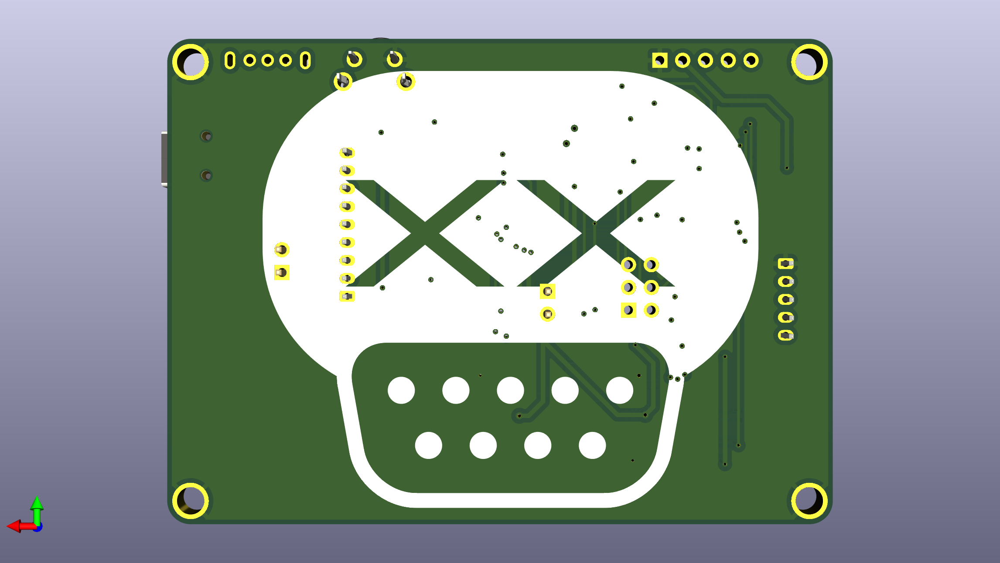
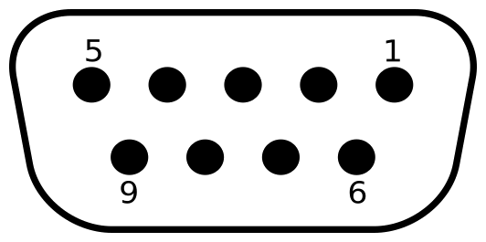
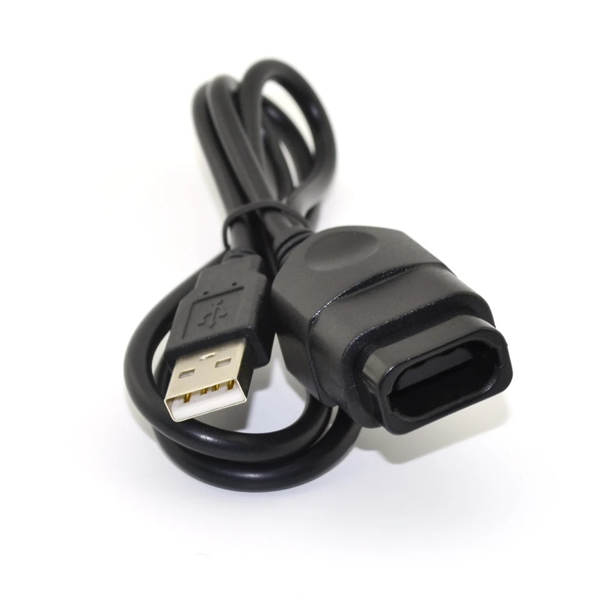
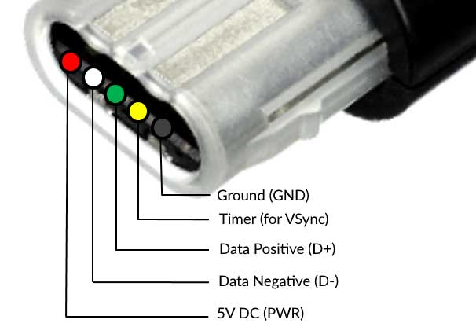
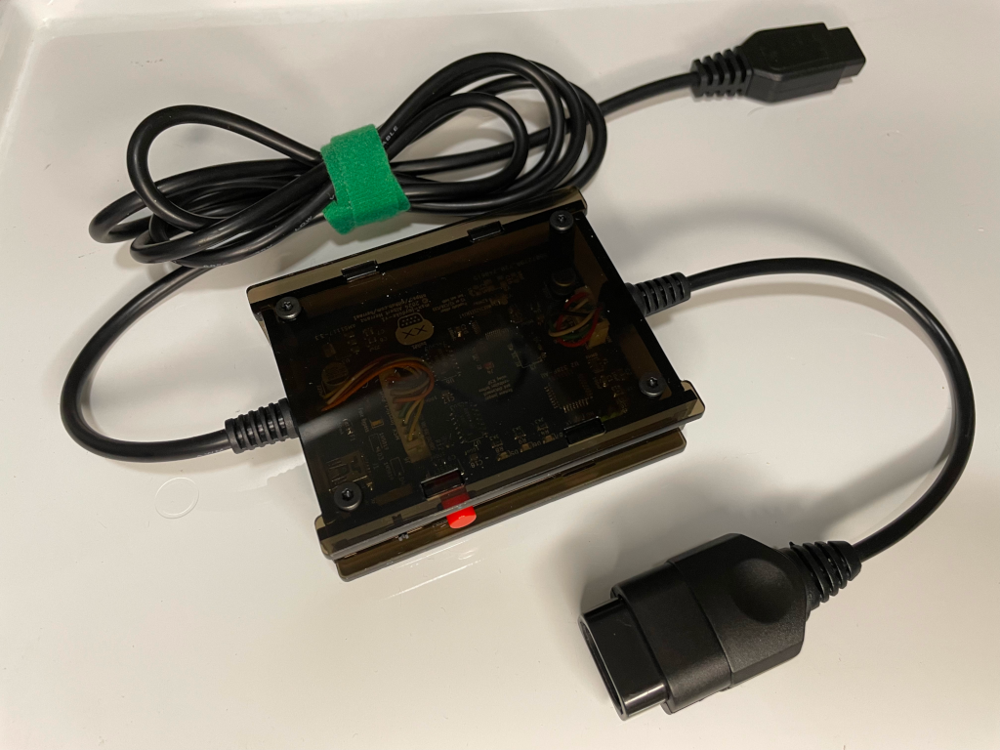
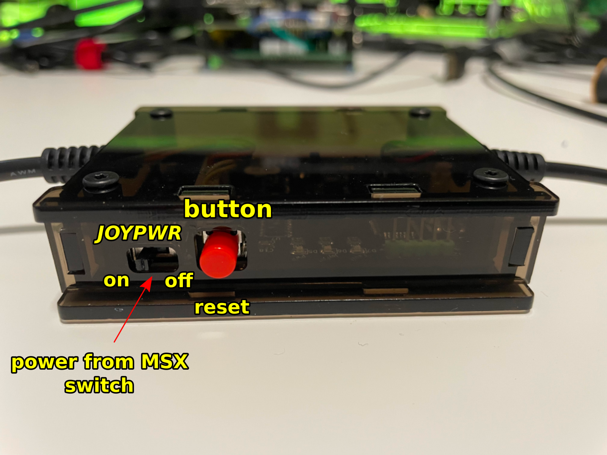
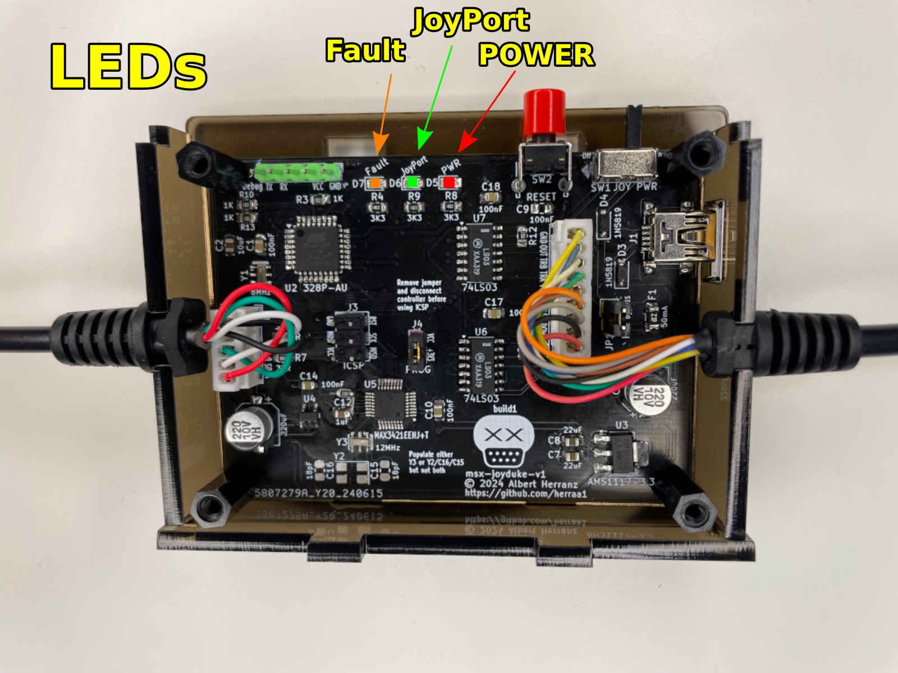

# Microsoft Xbox Original controller adapter for MSX (msx-joyduke) v1

Connect [Microsoft Xbox Original controllers](https://en.wikipedia.org/wiki/Xbox_controller) to [MSX computers](https://www.msx.org/wiki/).

## Introduction

The msx-joyduke v1 is an adapter that allows connecting Microsoft Xbox Original controllers to [MSX general purpose I/O ports](https://www.msx.org/wiki/General_Purpose_port).

The main features of the msx-joyduke v1 adapter are:
* made of widely available electronic components
* behaves as a cord extension between the MSX computer and the Microsoft Xbox Original controller
* uses a female standard DE9 connector on the adapter's MSX joystick side
* uses a Xbox Controller socket on the adapter's Microsoft Xbox Original controller side
* formally requires an external USB power supply as the adapter draws slightly more current than a MSX general purpose I/O interface can officially provide
* optionally, can be powered using a MSX general purpose I/O interface without an external power supply if your MSX can safely supply enough current
* power consumption of ~20mA for the adapter itself, between ~55mA and ~85mA depending on the Xbox controller connected
* serial debug provides information about the operation of the adapter

## [Hardware](hardware/kicad/)

The msx-joyduke v1 adapter uses an [Atmega328p](https://en.wikipedia.org/wiki/ATmega328) and a [MAX3421](https://www.analog.com/media/en/technical-documentation/data-sheets/max3421e.pdf) to convert the [Microsoft Xbox Original controller USB signalling](https://xboxdevwiki.net/Xbox_Input_Devices#USB_Adapters) to the [MSX joystick standard signalling](https://www.msx.org/wiki/Joystick_control).

A two-sided printed circuit board (PCB) is used to put together all components:
* An Atmega328p as the main MCU working at +3.3V and clocked at 8MHz
* A MAX3421 USB Host Controller with SPI interface
* A TPS2051C 500mA current limited switch for the host controller USB port
* An AMS1117-3.3 regulator to convert the 5V from the joystick or the mini USB port to the 3.3V used by the Atmega328p and the MAX3421 chips
* Two 74LS03 quad 2-input NAND gates with open collectors to completely mimic the standard MSX joystick behavior
* A PTC fuse to minimize damage to the MSX computer in case something goes wrong with the board
* Several additional required components (crystals/resonators, diodes, leds, resistors, ceramic capacitors and alumionium capacitors)
* A 9pin PH2.0 connector is used to connect the MSX cable extension
* A 5pin PH2.0 connector is used to connect the Xbox cable extension
* A 2.54 pitch debug header is added for serial debug and programming
* An ICSP header is provided for burning a bootloader or to flash the chip using a hardware programmer

Connection to the MSX general purpose I/O port is implemented using a DE9 joystick extension cable with a female DE9 connector on one side and a loose end on the other side.
The MSX joystick extension cable loose end is wired according to the following pinout mapping.

|  |
|:--|
| MSX joystick connector pinout, from controller plug side |

| MSX side pin | Cable color (may vary) | Signal |
| ------------ | ---------------------- | ------ |
| 5            | Brown                  | +5v    |
| 4            | Orange                 | RIGHT  |
| 3            | Grey                   | LEFT   |
| 2            | Black                  | DOWN   |
| 1            | Red                    | UP     |
| 6            | Green                  | TRIGA  |
| 7            | White                  | TRIGB  |
| 8            | Blue                   | OUT    |
| 9            | Yellow                 | GND    |

The msx-joyduke-v1 is fully compatible with MSX joysticks and honors the pin8 (OUT) signal.

Connection to the Microsoft Xbox Original controller is done via a PC USB for Microsoft Xbox Original controller converter adapter cable with a male socket (the ones present on the Xbox console itself).

|  |
|:--|
| PC USB for Microsoft Xbox Original controller adapter cable |

The cable is severed to get rid of the USB side (which can be used for other projects) exposing the USB wiring.

|  |
|:--|
| Microsoft Xbox Original connector pinout, from Microsoft Xbox Original controller side |

| Cable color official | Signal       | Comment                                                                   |
| ---------------------| ------------ | ------------------------------------------------------------------------- |
| Green                | D+           | USB Data +                                                                |
| White                | D-           | USB Data -                                                                |
| Yellow               | VSync        | (not used)                                                                |
| Black                | GND          | ground                                                                    |
| Red                  | +5V          | +5V power                                                                 |

The Microsoft Xbox Original controller uses 5V for power and logic.

### Recommended Build

Please, use [msx-joyduke-v1 Build2](#build2) for making new boards.

### [Build2](hardware/kicad/msx-joyduke-v1-build2)

[Bill Of Materials (BoM)](https://html-preview.github.io/?url=https://raw.githubusercontent.com/herraa1/msx-joyduke-v1/main/hardware/kicad/msx-joyduke-v1-build2/bom/ibom.html)

This is the first publicly released build of the msx-joyduke adapter.

## [Firmware](firmware/msx-joyduke-v1/)

The msx-joyduke v1 adapter firmware uses the [USB Host Shield 2.0 library](https://github.com/felis/USB_Host_Shield_2.0) to read the Microsoft Xbox Original controller status.

While developing the firmware, I noticed that some Xbox Original controllers were not working as expected. After a bit of troubleshooting the root cause was found and a [modification](https://github.com/felis/USB_Host_Shield_2.0/commit/b92fa02546dddd2278cd411e5d0e2d2ff614c8d8) to the library has been submitted and merged to fix the problem.

The following elements are used as inputs:
* digital pad (D-Pad), as direction arrows
* left and right analog pad as direction arrows
* A button, as Trigger 1
* B button, as Trigger 2

Those elements' status are processed by the msx-joyduke firmware and transformed into MSX general purpose I/O port's signals on the fly.

## [Enclosure](enclosure/)

### Acrylic

A simple acrylic enclosure design for the project is provided to protect the electronic components and provide strain relief for the extension cords.

The enclosure uses a 3mm acrylic sheet.

## Powering the msx-joyduke adapter

The msx-joyduke adapter uses under ~20mA when operating without a controller connected, but the power consumption can rise to ~85mA when an Xbox controller is connected.

On the other hand, a single MSX general purpose I/O interface is capable of delivering up to 50mA according to the MSX standard [^1].

That means that we are slightly over the max current specification for the MSX general purpose I/O interface.

Thus, the safest way to power the msx-joyduke adapter is by powering it via the USB mini connector of the board using an external 5V USB power supply. The board automatically powers up when using the USB mini connector without enabling any switch.

Nevertheless, even if the MSX especification puts such a low limit on the current that can be drawn from a general purpose I/O interface, real MSX hardware usually can safely deliver enough current for the msx-joyduke adapter to work correctly without harming our beloved classic computers.

Taking that into account, the msx-joyduke adapter has been enabled to be optionally powered by the a MSX general purpose I/O interface port.

To enable powering the msx-joyduke adapter from the _MSX Joystick Port_, the switch SW1 _JOYPWR_ must be first turned on by sliding the switch handle to the left.

> [!NOTE]
> A [1N5819 SMD Schottky diode](https://www.diodes.com/assets/Datasheets/1N5819HW.pdf) D4 is used to avoid leaking current from the msx-joyduke adapter to the MSX in case the msx-joyduke adapter is powered by USB while the _JOYPWR_ switch is ON.
> Another [1N5819 SMD Schottky diode](https://www.diodes.com/assets/Datasheets/1N5819HW.pdf) D3 prevents backpowering the USB side from the MSX side.
> And a Positive Temperature Coeficient (PTC) resettable fuse F1 of 50mA protects the MSX general purpose I/O interface port from excess of current in case something goes horribly wrong on the msx-joyduke adapter side.

To power the msx-joyduke adapter using a MSX general purpose I/O interface we must first understand how the PTC protections on the msx-joyduke adapter are implemented.

The selected PTC is rated for 50mA which is the so called Hold Current (the maximum current that can flow in normal operation). There is also the Trip Current (the minimum current necessary for the PTC to move to high-resistance state) which for the selected PTCs is around 100mA. Those thresholds are dependent on temperature and voltage. And to make things more undeterministic, the behavior of the PTC when current is between those thresholds is undefined (it may trip or not).

In normal operation and for a room temperature of around 25 degrees Celsius, the selected PTCs in practice never trip below 75mA.

> [!NOTE]
> Depending on the exact PTCs installed, the trip current may be slightly different and the adapter may trip at a different point. Unless you buy the PTCs from a reliable source, it is very difficult to know the exact PTC specifications. 
>
> Remember that the PTCs are provided as a safeguard in case something goes really wrong on the adapter, not to act as an exact current limiter to strictly comply with the 50mA per-port MSX specification.

A jumper JP1 can be used to bypass the PTC protections for the _MSX Joystick Port_.

> [!WARNING]
> Bypassing the PTC protection may damage your MSX computer.
> Do not bypass the PTC protections unless you known what you are doing.

By closing JP1 and **if our MSX computer can safely provide more than 85mA on a single MSX general purpose I/O interface**, we can connect the _MSX Joystick Port_ to the MSX computer and turn on the SW1 _JOYPWR_ switch to power the msx-joyduke adapter using a single joystick port.

In summary, we can use the following options to power the msx-joyduke adapter (from safest to less safe):
* via the board USB mini conector
  * turn off the SW1 _JOYPWR_ switch
  * connect a 5V USB power supply to the board USB mini connector
* via one of the MSX general purpose I/O interface, if your MSX can safely provide more than 85mA on each MSX general purpose I/O interface
  * close jumper JP1
  * turn on the SW1 _JOYPWR_ switch
  * connect the _MSX Joystick Port_ to a MSX general purpose I/O interface

## Switches and Buttons

| **Switch** | **State**      | **Description**                                                          |
|------------|----------------|--------------------------------------------------------------------------|
| _JOYPWR_   | Off            | power from MSX computer via a joystick port is off (except logic gates)  |
| _JOYPWR_   | On             | board electronics get power from MSX computer via a joystick port        |

> [!NOTE]
> If you plug a +5V USB power supply to the USB mini connector, the adapter will turn on unconditionally irrespective of the _JOYPWR_ switch position.
>

| **Button**   | **Description**                                                                             |
|--------------|---------------------------------------------------------------------------------------------|
| RESET        | restart the firmware                                                                        |

## LED indicators

| **LED**   | **State**      | **Indication** |
|-----------|----------------|---------------|
| _POWER_   | Off            | board is not receiving 3V3 power |
| _POWER_   | Solid Red      | board is receiving 3V3 power     |
| _JoyPort_ | Off            | no Xbox controller connected or recognized |
| _JoyPort_ | Solid Green    | Xbox controller connected and ready to use |
| _Fault_   | Off            | no power fault detected |
| _Fault_   | Solid Yellow   | excess of current detected on the Xbox connector |

## Compatibility Tests

| **Controller**                        | **Compatible** |
|---------------------------------------|----------------|
| 045e:0202 Microsoft X-Box pad v1 (US) | YES            |
| 045e:0289 Microsoft X-Box pad v2 (US) | YES            |

Other Xbox controllers may work but have not been tested.

## References

MSX general purpose I/O port
* https://www.msx.org/wiki/General_Purpose_port

Xbox controller pinout and protocol
* https://chris-donnelly.github.io/xboxpad.html

Atmega328p pinout
- https://camo.githubusercontent.com/18796d8b7673e3b6c14b6bdfb61d86b58c6f0d670398973abd4207afce960277/68747470733a2f2f692e696d6775722e636f6d2f6e6177657145362e6a7067

USB Host Shield 2.0 Library
* https://github.com/felis/USB_Host_Shield_2.0

[^1]: https://www.msx.org/wiki/General_Purpose_port

## Image Sources

* https://www.oshwa.org/open-source-hardware-logo/
* https://en.wikipedia.org/wiki/File:Numbered_DE9_Diagram.svg
